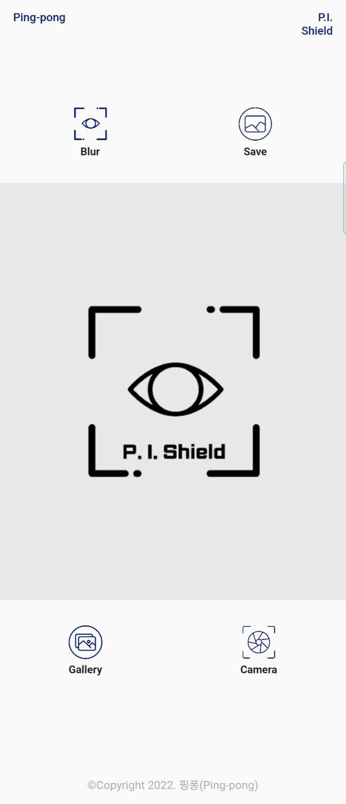
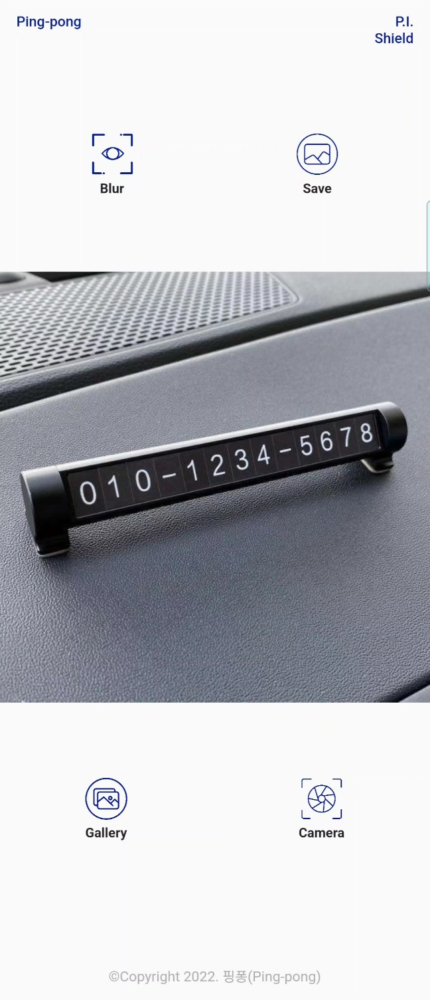
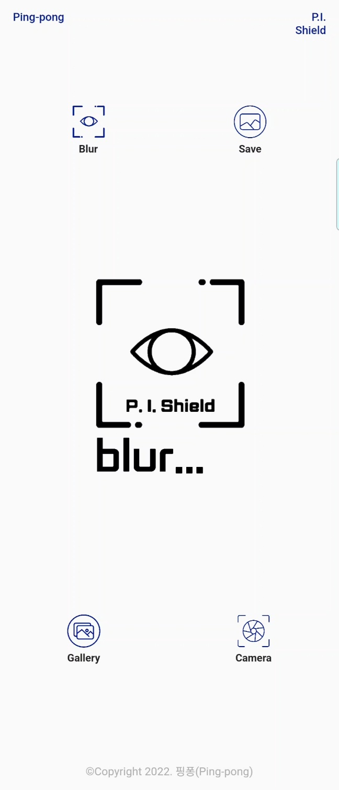
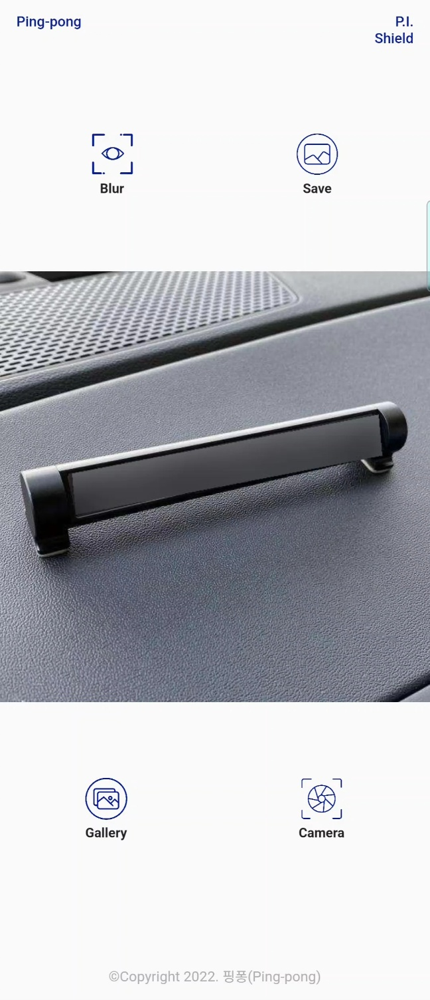
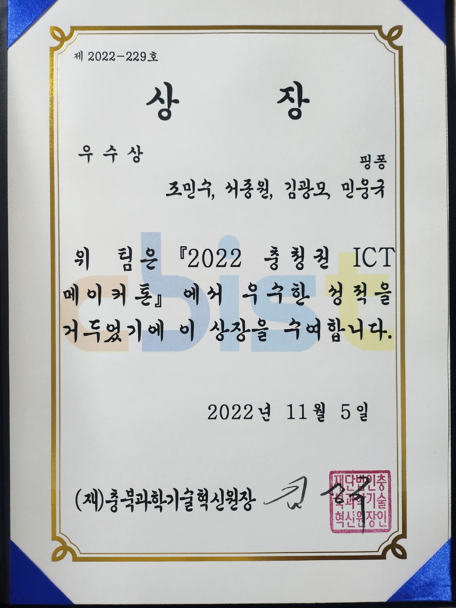

## P.I.Shield

## 2022 충청권 ICT 메이커톤 우수상 수상작 P.I.Shield

### 상금 2,000,000원 / 2등

### Team : Ping-pong

Leader : 조민수 (충북대학교 3학년 소프트웨어학과 재학)

TeamMate : 민웅규 (충북대학교 3학년 소프트웨어학과 재학)

TeamMate : 김광모 (충북대학교 3학년 소프트웨어학과 재학)

TeamMate : 서종원 (충북대학교 3학년 소프트웨어학과 재학)

### 1. Project 개요
   - Image에서 전화번호, 주소 등의 개인정보를 추출하여 개인정보로 판단되는 부분을 모자이크 후 Image 재생산

### 2. Project 의의
   - 개인정보 유출로 인한 피해를 막기 위한 기술의 개발 및 RESTfulAPI를 통한 배포

### 3. Project 목표
   - Image로 부터 일어나는 개인정보 유출 피해의 최소화

### 4. Project 적용분야
   - Instagram, Facebook과 같은 SNS
   - Naver MYBOX, Google Cloud와 같은 Cloud 서비스
   - SNOW, SODA와 같은 카메라 어플

### 5. Project 사용 기술 및 Framework
   - Flutter, OpenCV, FastAPI, Dart

## Project 결과화면

## AWARDS

